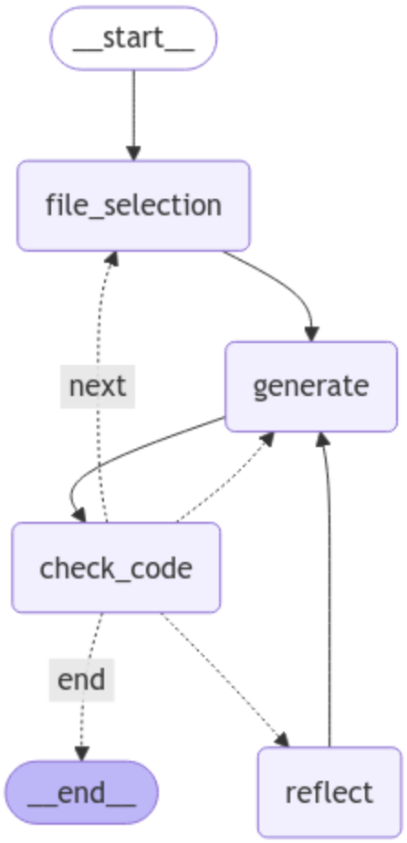

## Code Migration Demo
This is a demo of how an agentic workflow can be used to migrate/update code based on a high level code migration document. This agentic workflow will plan, code, check results, and self-correct the changes before saving them. 

#### Workflow Graph: 

#### Workflow Demo:
This demo is concise and focuses on migrating two Android files - an xml and kt file that both contain Button defintions that need migrated/updated. 

